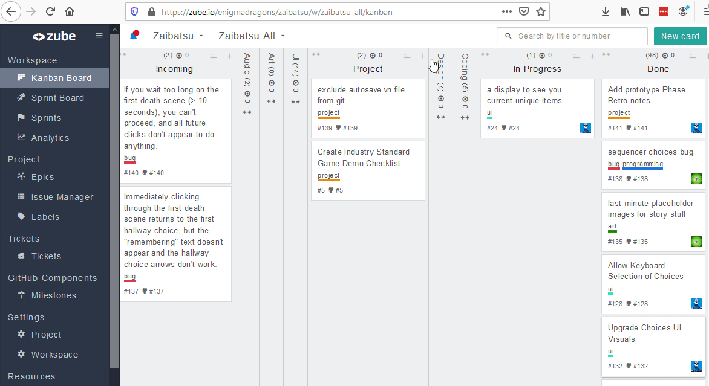

# Game Jam Kanban Board Setup Guide

----

### Join Kanban Board (New Member)

1. Send email address and Github username to Project Organizer
2. Check your email for a Github organization invite
3. After accepting Github organization invite, notify Project Organizer
4. Check your email for a Zube invite
5. After accepting Zube invite, notify Project Organizer
6. Try to open the Kanban board

----

### Kanban Card Practice (New Member)

</img>

1. Go To The Kanban Board
2. Click the "+" on the relevant Column
3. Set the "Only On Zube" dropdown to say "Source: ProjectName"
4. Enter your Task Title
5. Add a role label
6. Click "Create"
7. Click on the new card
8. Click "Assign to yourself"
9. Dismiss the Card
10. Drag the Card into the "In Progress" column
11. When the work is done and delivered, Drag the Card into the "Done" column

----

### Setup New Project Board (Admin)

1. Create Github Repo
2. Login to Zube
3. Click "Create a new project"
4. Select the Github Repo, and click "Create"
5. Setup Columns for: Audio, UI, Gameplay, Coding, Bugs, In Progress, Done 

----

### Add New Member (Admin)

1. Request New Member's Github username and email
2. Add member to Github Enigma Dragons Game Jam team
3. Go to Zube -> Organization Settings -> Invite Member by Email 
4. Wait for notification that invites have been accepted
5. Go to Board -> Project -> Members and add the new member
