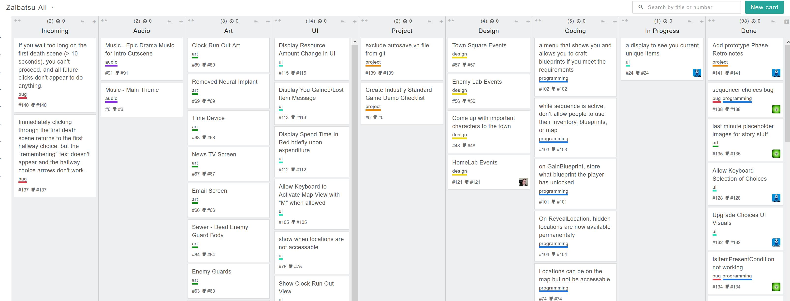

# Kanban Workflow Process

[Kanban](https://en.wikipedia.org/wiki/Kanban) is a workflow system that is designed to optimize throughput, so that value is delivered as quickly as possible.

We use the Kanban system for Game Jams since the most critical constraint is Time. 
- Scope can be changed during the jam. 
- Team sizes may vary. 
- But, the deadline is always a fixed time. 

----

### What are the key elements of Kanban?

1. All work should be visible.
2. Work should flow in only one direction.
3. Work should always be flowing through the system.

----

### Symptoms of a Project At Risk

1. Someone is working on something that the team doesn't know about.
2. Pieces of work are getting stuck, or needing to be reworked.
3. Deliverables are not flowing at a consistent rate.

----

### How do we visualize the work?

We use a Kanban board. It looks like this.

</img>

[See our Kanban Board Guide for our current board setup and process.](./kanban-board-guide.md)

----

### TL:DR - What do I need to do?

1. When you are ready for a new task, grab the top task in your Role column, assign it to yourself, and put it in `In Progress` column.
2. Only work on 1 task at a time.
3. When you finish a task, commit your artifact to Github, or send it to the team. Then move your task to the `Done` column
4. If you are working on the same task for more than 60 minutes, try to split the task and deliver what you presently have. 
5. If you are stuck on something and don't know how to proceed, reach out to your Role Lead or the Project Manager as quickly as possible.
6. If you are about to start a task and you are unsure of what is needed, reach out to your Role Lead or the Project Manager.
7. For artistic decisions, use your own creativity

**Key Principle:** Deliver small things as frequently as possible, tracked by Task cards. If you are stuck, get help from the team. 
